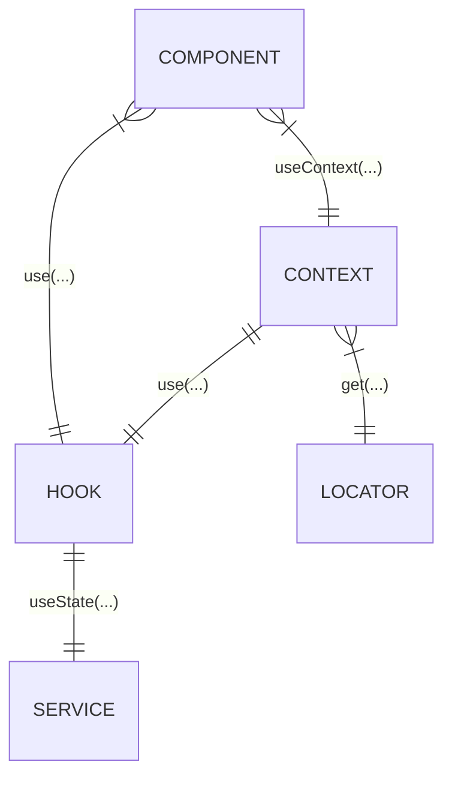

# React SOLID Services example

## Terminology

| Term                                 | Description                                                                                                                       |
| ------------------------------------ | --------------------------------------------------------------------------------------------------------------------------------- |
| Service                              | Logical unit responsible for a single high-level functionality (e.g. HttpService, LogService, AuthService).                       |
| Abstract Service / Service Interface | Contract to define and satisfy a Service (e.g. a HttpService must implement `get` and `post`).                                    |
| Service Locator                      | An "address book" for finding instances of Services without knowing the instantiation and implementation details.                 |
| (React) Hook                         | A function that connects an arbitrary Service with React's component lifecycles, enabling Service to indirectly refresh React UI. |
| (React) Context / Provider           | Hierarchical dependency injection for React components.                                                                           |

## Diagram



## Services

A Service represents a single responsibilty. Abstraction levels can vary,
e.g. a HttpService and a ApiService.

Each service has:

- A root directory under `src/services`.
- A `<service>.types.ts` that holds the Interface definition.
- A `impl/` subdirectory containing concrete implementations of the Service.

Each Services' folder is generic enough to be copied and used in multiple
projects without modification.

### Example Structure

```
src
└── services
    └── AuthService
        ├── AuthService.types.ts
        └── impl
            ├── GoogleAuthService.ts
            └── FacebookAuthService.ts
```

## Service Locator

## Hooks

Each service has a hook associated with it. A hook is responsible for using
React function (`useState` etc.) to manage an instance of a Service in a way
that keeps React UI in sync with any stateful changes to the Service instance.

Example: You have a select input in React where you can choose from different
API hosts. Selecting a host uses the hook to call a `setHost` function on an
`ApiService` instance as well as internally manage a `useState` to keep track
of the currently chosen host. A React text component then uses the same hook
to always show an up-to-date value of the current host.

Hooks reside under `src/hooks` and
are named `use<Service>.ts` (e.g. `useAuthService.ts`).

## Contexts & Providers

Contexts and Providers are a way of providing a pseudo-global instance of a Service
through the use of the service's hook. It's the same principle as using the hook
directly except the lifecycle management of the service instance is hidden away
further up the component tree and every consumer of the context (using React's
`useContext(...)` call) use the same instance.

Note that `useContext(..)` uses the instance closest up the tree, so if multiple are
present only the nearest is used, which can be used to selectively override a service
deeper down the component hierarchy.

Contexts and providers are located under `src/contexts` and are named
`<Service>Context.tsx` (e.g. `AuthServiceContext.tsx`). Each context file exports
the context itself (the output of a React `createContext(..)` call) and the provider
that should be used to build the component tree.

Providers are ordered by their dependencies to each other (if any) and are usually the
top-most components in a React app, for example:

```html
<ServiceLocatorProvider>
  <EnvironmentProvider>
    <AuthServiceProvider>...</AuthServiceProvider>
  </EnvironmentProvider>
</ServiceLocatorProvider>
```

In this project all providers are exposed together as the
`src/components/organisms/Providers` component.

# Showcase

- [ ] ServiceLocator
  - [ ] type safety
- [ ] Portability (symlink test)
- [ ] Hot-swap services
- [ ] Hooks
  - [ ] Isolering från ServiceLocator
- [ ] Contexts/Providers
- [ ] Service dependencies

# Issues

- Using `ApiViewCountService` and logging in/out does not trigger a refresh of the View Count UI.
  - This is sort of intentional? The only hard connection between `Auth` and `ViewCount` is done at Service-level, meaning no React component can possibly know that `ViewCount` state is dependent on `Auth` state.
  - Possibly solve by explicit refresh when `Auth` state changes (i.e. switching "screen" after a login or re-mounting `ViewCount` UI).
